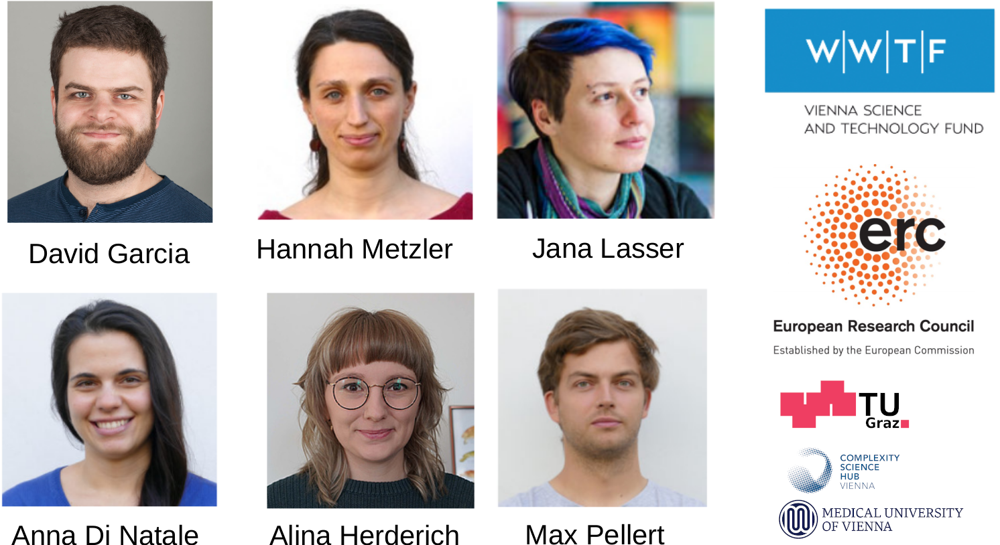
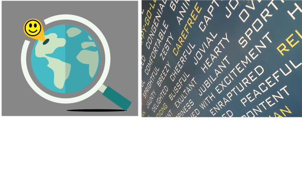

```{r xaringan-themer, include=FALSE, warning=FALSE}
#This block contains the theme configuration for the CSS lab slides style
library(xaringanthemer)
library(showtext)
style_mono_accent(
  base_color = "#5c5c5c",
  text_font_size = "1.5rem",
  header_font_google = google_font("Arial"),
  text_font_google   = google_font("Arial", "300", "300i"),
  code_font_google   = google_font("Fira Mono")
)
```

```{r setup, include=FALSE}
options(htmltools.dir.version = FALSE)
```


layout: true
<div class="my-footer"><span>David Garcia - Computational Social Science Lab - TU Graz + CSH Vienna</span></div> 

---

## The Computational Social Science Lab Austria
<center>
```{r, echo=FALSE, out.width=925}

```

---

## The Hype Cycle of Computational Social Science
<center>
```{r, echo=FALSE, out.width=900}
knitr::include_graphics("figures/Hype1.svg")
```

---
## The Hype Cycle of Computational Social Science
<center>
```{r, echo=FALSE, out.width=900}
knitr::include_graphics("figures/Hype2.svg")
```
---
## The Hype Cycle of Computational Social Science
<center>
```{r, echo=FALSE, out.width=900}
knitr::include_graphics("figures/Hype3.svg")
```
---

```{r, echo=FALSE, out.width=950, fig.align='center'}
knitr::include_graphics("figures/earth.svg")
```

---

layout: true
<div class="my-footer"><span>
<a href=https://arxiv.org/abs/2107.13236> Social media emotion macroscopes reflect emotional experiences in society at large. David Garcia, Max Pellert, Jana Lasser, Hannah Metzler. https://arxiv.org/abs/2107.13236 (2021)</a></span></div>

---

# Social Media Macroscopes of Emotions

.pull-left[
```{r, echo=FALSE, out.width=1100}
knitr::include_graphics("figures/Macy.jpg")
```
<font size="5">
<a href="https://science.sciencemag.org/content/333/6051/1878/"> Diurnal and seasonal mood vary with work, sleep, and daylength across diverse cultures. Golder & Macy, Science (2011) </a>
</font>
]

.pull-right[
```{r, echo=FALSE, out.width=1100}
knitr::include_graphics("figures/hedonometer.png")
```

<font size="5">
<a href="https://journals.plos.org/plosone/article?id=10.1371/journal.pone.0026752"> Temporal patterns of happiness and information in a global social network: Hedonometrics and Twitter. Dodds et al. PLoS One (2011) </a>
</font>
]

---

# Social Media Macroscopes of Emotions
.pull-left[
```{r, echo=FALSE, out.width=500}
knitr::include_graphics("figures/Paris.png")
``` 
<font size="5"> <a href="https://journals.sagepub.com/doi/full/10.1177/0956797619831964"> Collective Emotions and Social Resilience in the Digital Traces After a Terrorist Attack. Garcia & Rime, Psychological Science (2019) </a>
</font>
]

.pull-right[
```{r, echo=FALSE, out.width=1100}
knitr::include_graphics("figures/COVID.png")
```

<font size="5">
<a href="https://psyarxiv.com/qejxv"> Collective Emotions During the COVID-19 Outbreak. Metzler et al. Psyarxiv (2021) </a>
</font>
]

---

## Limits of Social Media Data to Study Emotion

```{r, echo=FALSE, out.width=1100}
knitr::include_graphics("figures/Jaidka.png")
```

[Estimating geographic subjective well-being from Twitter: A comparison of dictionary and data-driven language methods. Jaidka et al. PNAS (2020)](https://www.pnas.org/content/117/19/10165.short)

---

# Validating a UK emotion macroscope
1. Two years of weekly representative UK emotion survey by YouGov
2. UK Twitter data for the same period: 1.5 Billion tweets (without RT)
3. Text analysis: dictionary-based (LIWC) and supervised (RoBERTa)
4. Gender-rescaled time series of emotional expression
5. Pre-registered hypotheses with prediction period from Nov 2020

```{r, echo=FALSE, out.width=900, fig.align='center'}
knitr::include_graphics("figures/Data.svg")
```

---

# Sadness in Twitter and YouGov

```{r, echo=FALSE, out.width=1200, fig.align='center'}
knitr::include_graphics("figures/Sadness.svg")
```

- Similar results with dictionary-based and supervised (r~0.65)
---

# Anxiety in Twitter and YouGov

```{r, echo=FALSE, out.width=1200, fig.align='center'}
knitr::include_graphics("figures/Anxiety.svg")
```

- Better results with dictionary-based method and with gender rescaling
- Results robust to autocorrelation and heteroskedasticity

---

# Joy in Twitter and YouGov

```{r, echo=FALSE, out.width=1200, fig.align='center'}
knitr::include_graphics("figures/Joy.svg")
```

- Substantially better results with supervised method than dictionary-based
---

# Exploring 12 emotional states
.pull-left[

- Time series of number sentences like "I am [emotion]" on Twitter

- Weak correlations happen for infrequent emotions in text

- Comparison: US weekly pre-election polls correlate with 0.66

- Arxiv preprint at https://arxiv.org/abs/2107.13236

]

.pull-right[
```{r, echo=FALSE, out.width=700}
knitr::include_graphics("figures/Figure2.svg")
```
]

---

layout: true
<div class="my-footer"><span>
<a href="https://arxiv.org/abs/2108.07646">Validating daily social media macroscopes of emotions. Max Pellert, Hannah Metzler, Michael Matzenberger, David Garcia. (2021) </a> </span></div>

---

## Study 2: Validating an Austrian macroscope

.pull-left[

- 20-day emotion survey in derstandard.at (N=268,128)
- Daily frequency, 3-day windows

- Text from Der Standard forum (N=452,013)

- Austrian tweets (N=515,187) filtered as UK macroscope

- Compared dictionary-based (LIWC) and supervised model (GS)

]
.pull-right[
```{r, echo=FALSE, out.width=800}
knitr::include_graphics("figures/DS1.svg")
```
]

---

## Twitter sentiment and Der Standard survey

```{r, echo=FALSE, out.width=1000, fig.align='center'}
knitr::include_graphics("figures/DS2.svg")
```

---

# Correlations with new COVID-19 cases

.pull-left[
```{r, echo=FALSE, out.width=600}
knitr::include_graphics("figures/DS31.svg")
```
]
.pull-right[
```{r, echo=FALSE, out.width=600}
knitr::include_graphics("figures/DS32.svg")
```
]

- Do correlations attenuate due to additional social media measurement error?
- Survey emotion correlation with new cases as strong as Twitter sentiment
- Errors sources might be different: Need for conceptual validations

---

layout: true
<div class="my-footer"><span>
<a href=https://arxiv.org/abs/2107.13236> Social media emotion macroscopes reflect emotional experiences in society at large. David Garcia, Max Pellert, Jana Lasser, Hannah Metzler. https://arxiv.org/abs/2107.13236 (2021)</a></span></div>

---

# Social Sensing Emotions

```{r, echo=FALSE, out.width=725, fig.align='center'}
knitr::include_graphics("figures/socialsensing.svg")
```

3rd person and tweet emotion: +74.85% in anx. +62.12% in sad +34.97% in pos.

---

```{r, echo=FALSE, out.width=1050, fig.align='center'}

```

---

```{r, echo=FALSE, out.width=1050, fig.align='center'}

```

---

```{r, echo=FALSE, out.width=1050, fig.align='center'}
knitr::include_graphics("figures/summary3.svg")
```

---


# Thanks for listening!
.pull-left[
```{r, echo=FALSE, out.width=750, fig.align='center'}

```

New English-speaking **masters programme** at Uni Graz and TU Graz
]
.pull-right[
**Open positions:**
- [2-year postdoc for Honesty NLP project in Bristol (until Oct 3)](https://www.bristol.ac.uk/jobs/find/details/?jobId=255476&jobTitle=Senior%20Research%20Associate)

**Upcoming positions**:
- PhD at CSH Vienna (NLP for psychological research)
- 2-year postdoc at TU Graz </br> (from Feb 1st)
]

<center>

**More at: [www.dgarcia.eu](https://dgarcia.eu) and [@dgarcia_eu](https://twitter.com/dgarcia_eu)** </br>
Slides:  [www.dgarcia.eu/ISDS-2021](http://www.dgarcia.eu/ISDS-2021)

